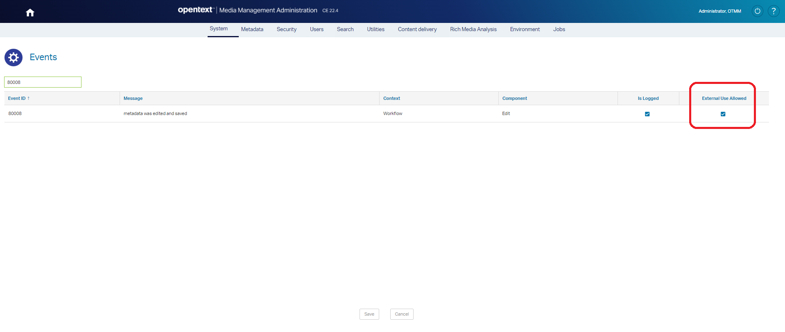
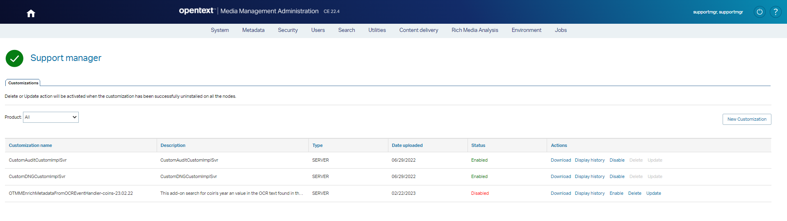
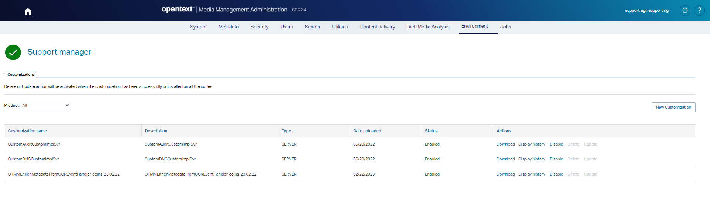

# OTMMEnrichMetadataFromOCREventHandler
**OpenText Media Management (OTMM)** Event listener which listen the event **Metadata Updated (80008)**.
This event is launched once the metadata of an asset are updated.  

> IMPORTANT: These add-ons have been developed and tested on **OTMM 22.4**

## Sub-projects 
There are two sub-projects:

 * [Plates](doc/plates.md): This add-on search for Spanish plate number in the OCR text found in the image
 * [Coins](doc/coins.md): This add-on search for coin's year and value in the OCR text found in the image
 
## Deployment

### External Use Allowed for Event *80008 - metadata was edited and saved*

* Browse to your *Media Management Administration Dashboard*: &lt;OTMM_BASE&gt;/teams
* Click on `System » Event`

  
  
* Introduce `80008` in the *Search...* text box and press *ENTER*

> **80008** event means	`metadata was edited and saved`

  

* Click on `External Use Allowed` if disabled

  
  
* Click on `Save` button

### External Use Allowed for Event *80008 - metadata was edited and saved*

* Login on *Media Management Administration Dashboard*: &lt;OTMM_BASE&gt;/teams as `supportmgr` or any other user with support manager option enabled
* Click on `Environment » Support Manager`

  
  
* Click on `New customization` button  

  

* On `Upload Customization` screen:

  * **File**: Upload zip file with your customization

  > **NOTE**: You can use the zip file included in the `customization` folder of this repository, or
  > you can follow this manual to [Prepare the customization files for upload](https://docsapi.opentext.com/docs/pi_hosted/_org/ofh1/index.html?/medmgt220400-h-agd-en/prep-upload-cust.html)
  
  * **Description**: `Must be the same that the customization name`, in our example *OTMMEnrichMetadataFromOCREventHandler-coins-23.02.22*
  * **Type**: `SERVER`
  * **Product**: `OTMM`
   
  

* Click on `Upload` button.  By default, the customization is disabled

  

* Click on `enable` in the row that corresponds to your customization
  
  
    
    
  
## Tips and tricks

Just some topics related to this project that can be handly:

 * [Mark OTMM customization for deletion in a containerized environment](doc/mark-customization-for-deletin.md)
 * [Required jar files](doc/required-jar.md)
