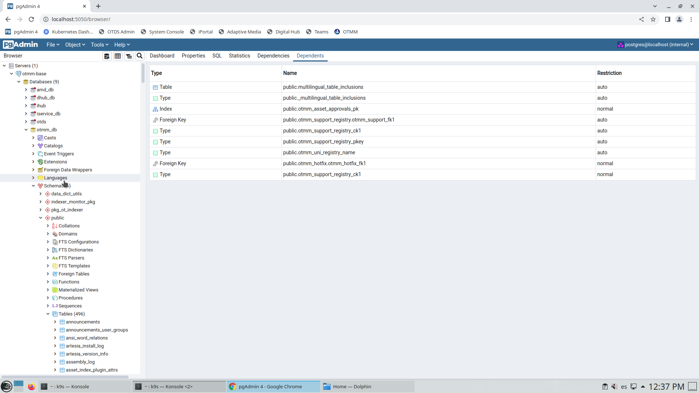
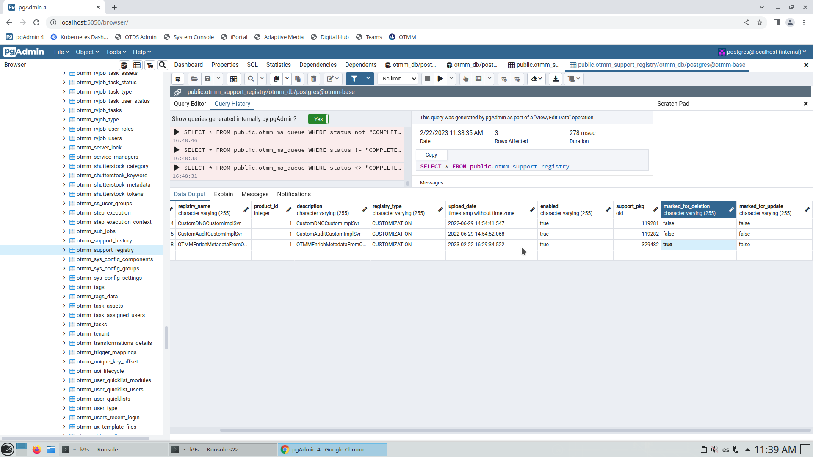
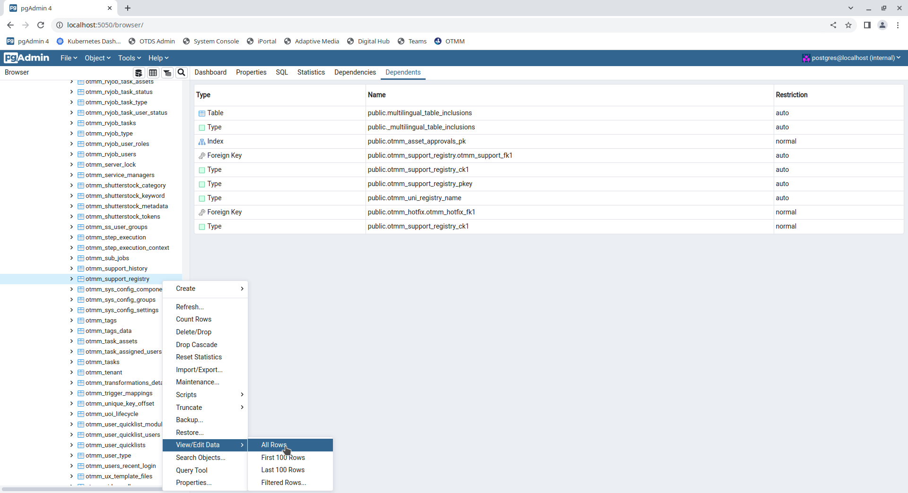
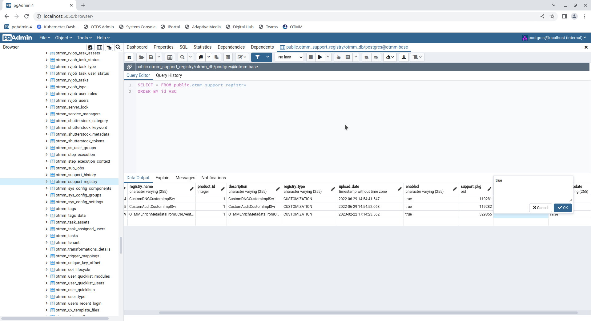
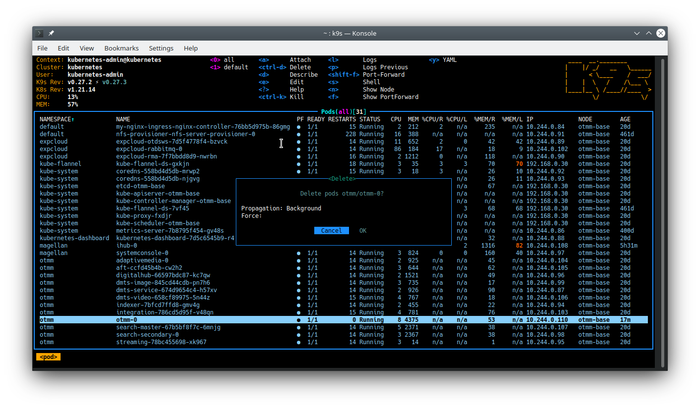

# Mark OTMM customization for deletion in a containerized environment

In some circumstances, you may need to delete a customization deployed in a containerized OTMM.
Just follow these steps:

 * Access your environment
 * Open **pgAdmin** in a browser. i.e. *http://localhost:5050/browser/*
 * Browse to `Servers  » otmm-base  » Database  » otmm_db  » schema  » public  » Tables`   

   
 
 * Select the table called `otmm_support_registry`   
   
   
   
 * Right click on `otmm_support_registry` and select `View/Edit data  » All rows`
 
   
    
  * Edit the value of the column `marked_for_deletion`. Set the value to `true`
 
    
    
Now let's apply our changes in our containerized environment.     

 * Open `K9s` application
 * Select your OTMM pod called `otmm-0`
 * Make `CTRL + d` to delete your pod

   
      
 * Select `OK` button and press `ENTER`
 * Wait until the pod is *terminated* and *running*. It'll take a few minutes.
 
Now you can access to your OTMM environment. The customization has been deleted.
 